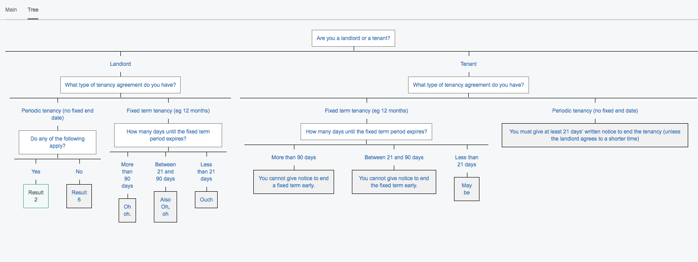
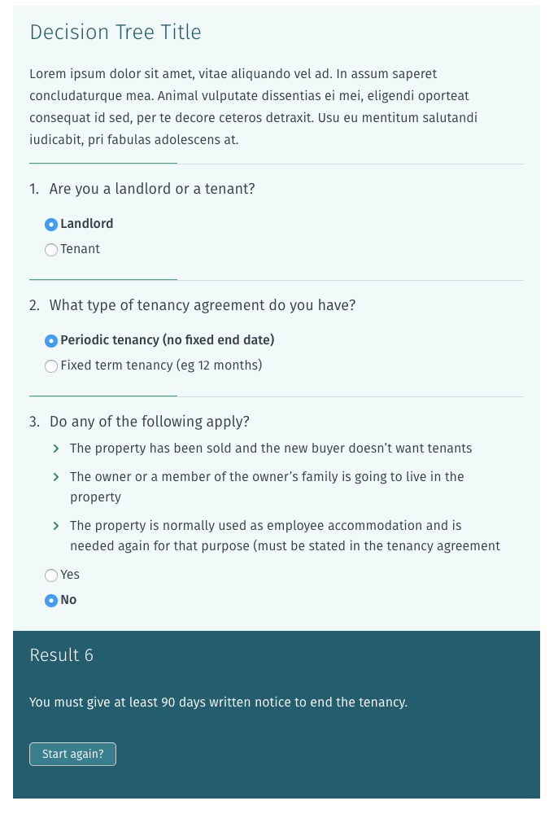

# Element Decision Tree

## Introduction

A decision tree is a succession of questions which depends on each others answers and displays a result accordingly.
This module provides an easy way to build such tree and to add it to a page as an element.

## Installation (with composer)

	$ composer require dnadesign/silverstripe-elemental-decisiontree

## Requirements

* SilverStripe 4.x
* (dnadesign/silvertsripe-elemental)[https://github.com/dnadesign/silverstripe-elemental]

## Screenshots

