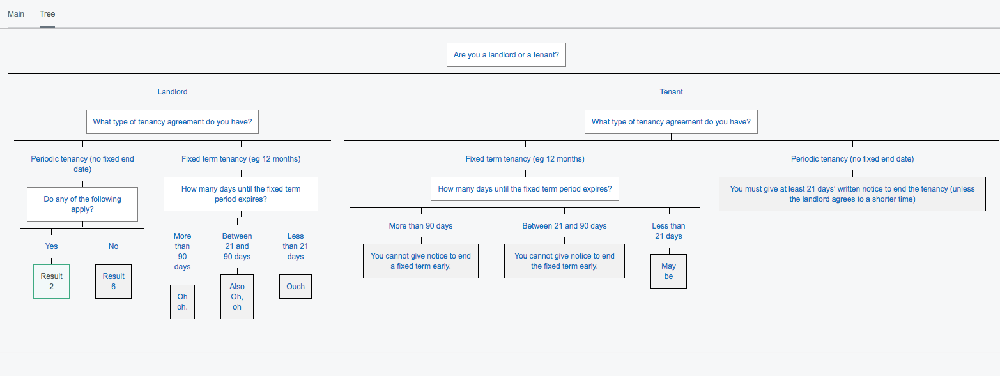
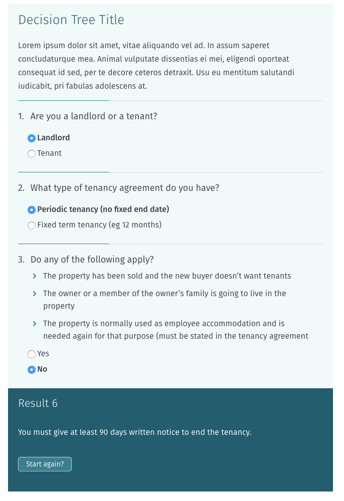

# Element Decision Tree

## Introduction

A decision tree is a succession of questions which depends on each others answers and displays a result accordingly.
This module provides an easy way to build such tree and to add it to a page as an element.

## Installation (with composer)

	$ composer require dnadesign/silverstripe-elemental-decisiontree

## Requirements

* SilverStripe 5.x
* (dnadesign/silvertsripe-elemental)[https://github.com/dnadesign/silverstripe-elemental]

## Configuration

The module automatically loads its JS and CSS only on pages that contain a decision tree element. This behaviour can be customised via YML config.

### Available options

| Option | Default | Description |
| --- | --- | --- |
| `javascript` | `'dnadesign/silverstripe-elemental-decisiontree:javascript/decision-tree.src.js'` | Path to the JS file to load. Set to empty string to disable. |
| `css` | `'dnadesign/silverstripe-elemental-decisiontree:css/decisiontree.css'` | Path to a CSS file to load. Set to empty string to disable. |
| `auto_detect` | `true` | When enabled, checks if the current page has a decision tree element before loading assets. Set to `false` to load assets on all pages. |

### Examples

Use your own JS instead of the module's default:

```yaml
SilverStripe\Control\Controller:
  javascript: 'app/javascript/my-decision-tree.js'
```

Use your own CSS instead of the inline focus styles:

```yaml
SilverStripe\Control\Controller:
  css: 'app/css/my-decision-tree.css'
```

Disable all asset loading:

```yaml
SilverStripe\Control\Controller:
  javascript: ''
  css: ''
```

Load assets on all pages (skip automatic element detection):

```yaml
SilverStripe\Control\Controller:
  auto_detect: false
```

## Screenshots



